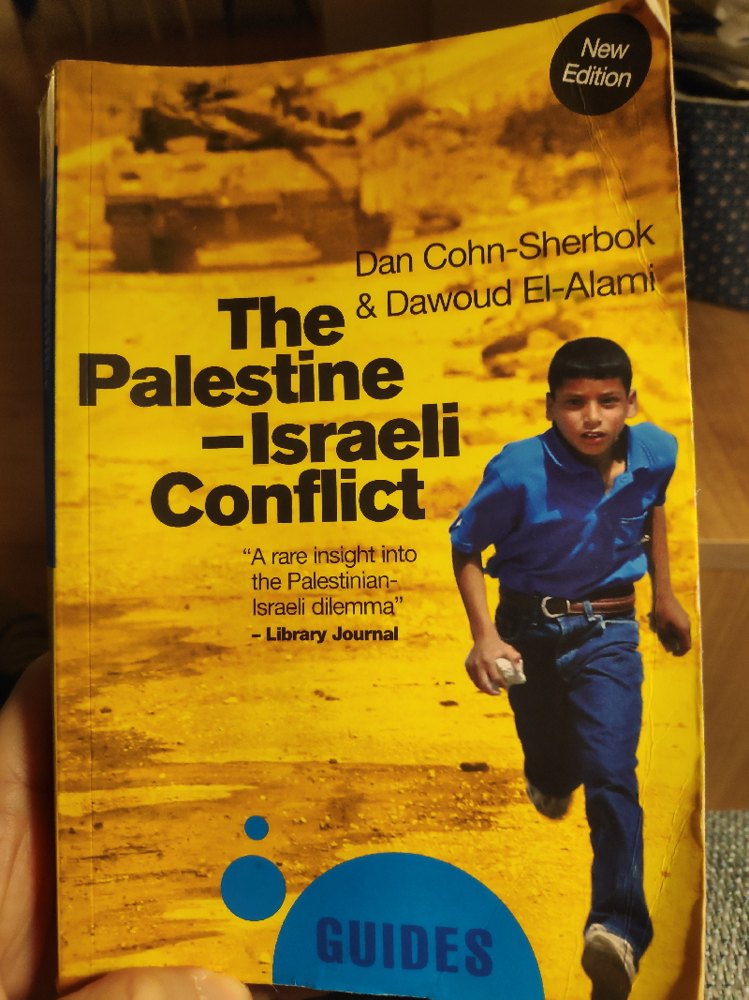
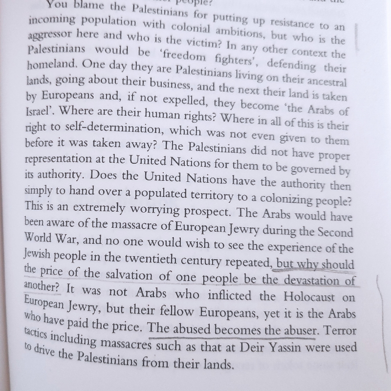

Striking book, must-read. The Palestine-Israeli Conflict: A Beginner's Guide. The first book I've read on the subject. Very insightful despite listing a bunch of names and exact dates with are not as relevant for me personally.

The book is written by Dan Cohn-Sherbok representing the Israeli side and Dawoud El-Alami representing the Palestine side. It is not a collaboration. Each wrote half of the book, plus the response to each other - Debate part.

Israeli perspective by Cohn-Sherbok isn't all that different from what average Western Joe like me know: push to create the homeland, UN resolution, Israel created, struggle, attacks, peace talks leading nowhere. Pretty mechanistic. Facts already in mass consciousness. 3/n

The history from Palestine's perspective by El-Alami is more insightful and humane. Facts stated, mistakes admitted, names named, and feelings expressed. And it all makes sense. It all makes sense, and you can get behind it.

The most striking part of the book is the relatively short Debate. Cohn-Sherbok goes not to ask why Arabs of Palestine did not comply with the orders of European powers and silently made room for newcomers, and why they continue to resist, have not they heard of Holocaust?

In the last part Sherbok just resorts to "whataboutism" and goes on quoting anti-Semites, Islamic extremists, and other weirdos to prove that Israelis need protection. He is not wrong, but also sounds like a douche and justifies the oppression of Arabs of Palestine. 7/n

The reply by El-Alami is sharp and logical. He points out that the British had no authority over Palestine, and it was not for them to decide who should have statehood in Palestine. Asking Arabs to comply was not exactly fair.

Book is good, maybe the best for a beginner. It does not give two sides. I already knew one side. It gives the second side of the story.

Takeaways:
* British will screw you if you give them a chance.
* Do not boycott decision-making, the decision will be made without you.
* Abused can easily turn into an abuser.
* UN should grow some balls.
* I have to put the Palestinian Flag into my bio
* Read the book: https://amzn.to/3d6jX54
