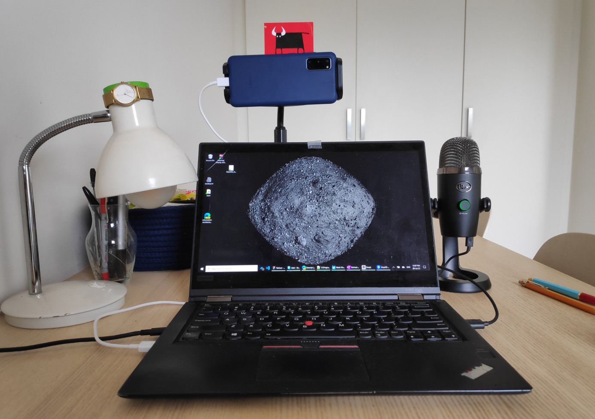
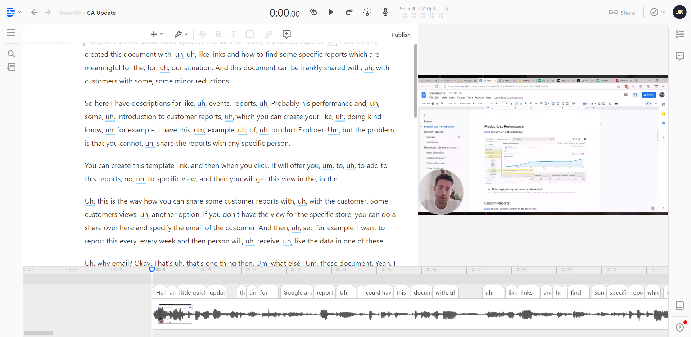

### How I kludged my recording setup from the parts I already own and the $5 app

Recently I've become contributing UX Mentor at [CareerFoundry](https://careerfoundry.com) [(1)](). That means that I need to record design critiques on students' submissions. And as anyone knows, you can not start jogging, without first spending a fortune on new running sneakers and ultra hi-tech shorts, t-shirts, and socks cut from space-age membrane fabric, I could not just start recording video. I needed to invest in a good setup. Let's take a look at each component.

## Microphone
Fortunately for me, I own Blue Yeti Nano from my previous failed project. If you are not as lucky as I am, you heed to get yourself a decent USB mic. USB is good, you do not need to have an XLR interface even if it sounds cooler. Plus, you will be able to connect it to your phone. Speaking of phones.

## Camera
I use my phone as the camera. All you need is to find an app that will work with your phone and OS. In my case, Windows 10 + Android phone was [DroidCam](https://www.dev47apps.com/). It costs $5, works over USB or network. It also allows you to use the mic in the phones, but I'm not sure about the quality. Read the instructions, there are some hoops to jump over, but all doable.

## Recording software
[mmhmm](https://www.mmhmm.app/) is the one. It allows you to combine your case in the bubble with screen-sharing and slides if you need to.

## Editing software

I do much of the editing at the moment. When I screw the take I just rerecord the whole thing. If I have to edit, I would use [Descript](https://www.descript.com/) for editing. It does a decent job auto transcribing the video and then you can [remove all your 'uh'-s 'am'-s and 'um'-s](https://medium.com/descript/using-descript-to-remove-filler-words-from-audio-recordings-2e9b98a5c8af) if you like to. It's not going to be a super smooth cut when done automatically, but if used responsibly can lead to good results. Plus, it can do your regular video editing staff: multiple tracks, transitions, and something called [overdub](https://www.descript.com/overdub). Check it out.

That is the whole setup. Thank you for reading, hope you liked it. Talk later.

Yours, [@jkovzels](https://twitter.com/jkovzels)

(1) [CareerFoundry referral link with 5% discount](https://careerfoundry.com/en/referral_registrations/new?referral=krdzJ1E8) just in case. I will get a kickback as well.

