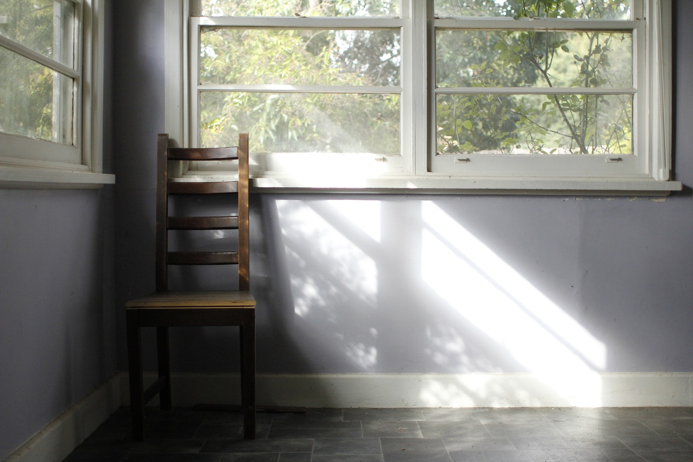

# Browsers are not designed for next larger context.

_photo by [@DTeychenne](https://twitter.com/DTeychenne)_

We pick pages to open based on the short search term we type into search engines, link text, sometimes page description, and your attitude to the person sharing the link. That is it, that is the entire context. And even this context is lost almost immediately. Of course, you still have your internal context, in your memory, and consciousness, but it is too fluid and fragile. We switch tasks, we leave the things unfinished. This context will not do much for you the day or two after.

World-famous architect Eliel Saarinen once said:

**_“Always design a thing by considering it in its next larger context — a chair in a room, a room in a house, a house in an environment, an environment in a city plan.”_**

Browsers are not designed this way. Search engines are not designed this way either. Browsers display the pages well. Search engines serve results for your search query reasonably well.
None of this is our true goal when we use browsers and search engines. Use them to do the research, solve a technical problem, learn something view.  This is what 'larger context' is, and think we are lacking tools designed to support this context and goals.

Follow me on Twitter [@ykovzel](https://twitter.com/ykovzel) for more.

Juri out.
